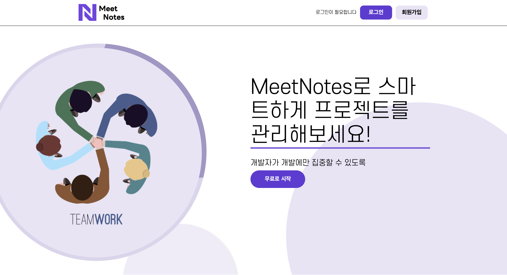
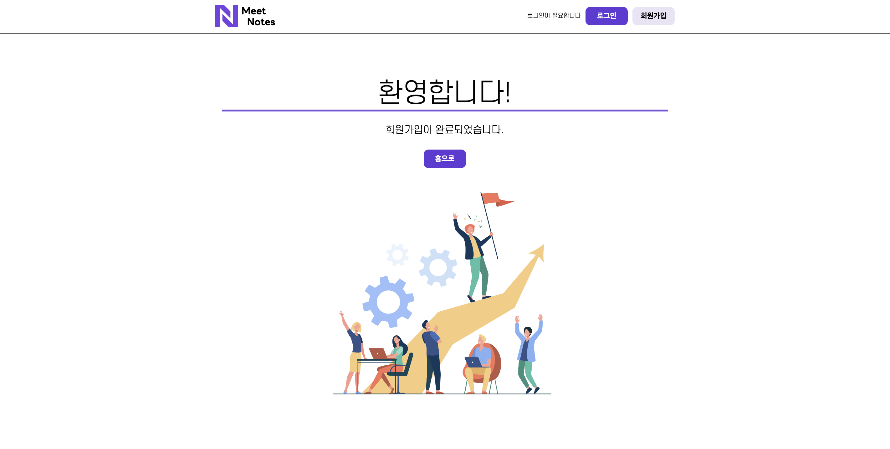
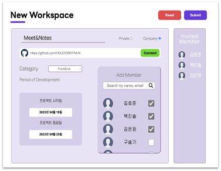
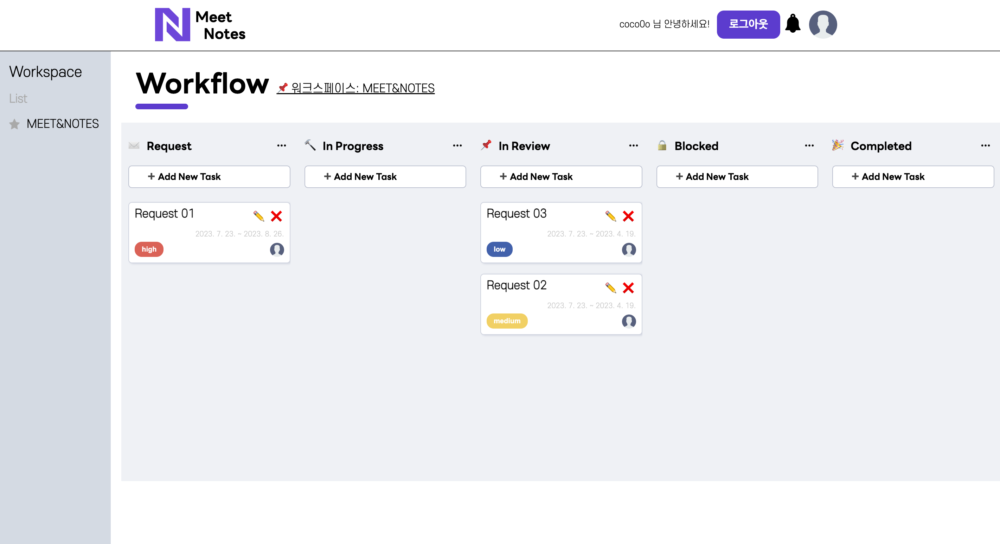

# Meet&Notes

<div align="center">
  
</div>

## 팀원 소개

|                                      구슬기                                      |                                      김은정                                      |                                      김호준                                      |                                     박성재                                      |                                      백진솔                                      |
| :------------------------------------------------------------------------------: | :------------------------------------------------------------------------------: | :------------------------------------------------------------------------------: | :-----------------------------------------------------------------------------: | :------------------------------------------------------------------------------: |
|  |  |  |  |  |
|                     [@guseulgi](https://github.com/guseulgi)                     |                       [@0uizi0](https://github.com/0uizi0)                       |                     [@HOJOON07](https://github.com/HOJOON07)                     |                [@qkrtjdwo5662](https://github.com/qkrtjdwo5662)                 |                    [@KARIS-SOL](https://github.com/KARIS-SOL)                    |
|                              Front-end <br/> Design                              |                                    Front-end                                     |                             Front-end <br/> Back-end                             |                                    Back-end                                     |                                    Front-end                                     |

## 프로젝트 소개

프로젝트 기획 방향 및 세부 사항 공유를 통한 효율적인 프로젝트 진행을 위해 기획된 서비스입니다.

애자일 프로젝트 관리 도구 중 하나인 Jira의 프로세스를 참고하였습니다.

## 시작 가이드

### Requirements

For building and running the application you need:

- Node.js 18.16.0
- Npm 9.5.1

### Installation

```bash
$ git clone https://github.com/0uizi0/M-N
$ cd M-N
```

#### Run

```bash
$ npm install
$ npm start
```

---

## Stacks 🐈

### Environment


### Config


### Development


### Communication


---

## 화면 구성 📺

|                               메인 페이지                               |                           회원가입 페이지                            |
| :---------------------------------------------------------------------: | :------------------------------------------------------------------: |
|                    |  |
|                           워크스페이스 페이지                           |                     워크플로우(칸반보드) 페이지                      |
|  |             |

---

## 주요 기능 📦

### ⭐️ 프로젝트 별 작업 공간 생성 및 팀원 초대 기능

- 작업 공간 생성 시, 초대된 팀원만 접근 가능하도록 함
- 추후 깃허브 레퍼지토리와 연결 예정

### ⭐️ 칸반보드 형식의 프로젝트 공간

- 애자일 프로젝트 템플릿인 칸반 보드를 활용해 해야 할 업무를 시각화
- 각 업무의 단계를 따라 이슈 카드가 배치되어, 프로젝트의 진행 상황을 쉽게 파악 가능

---

## 아키텍쳐

### 디렉토리 구조

```bash
📦src
 ┣ 📂assets
 ┣ 📂components
 ┃ ┣ 📜Footer.jsx
 ┃ ┣ 📜GlobalStyle.jsx
 ┃ ┣ 📜Header.jsx
 ┃ ┗ 📜Nav.jsx
 ┣ 📂pages
 ┃ ┗ 📂components
 ┃   ┣ 📂CreateWorkspace
 ┃   ┣ 📂Main
 ┃   ┣ 📂SignUp
 ┃   ┣ 📂Workflow
 ┃   ┗ 📂workspaceList
 ┣ 📂store
 ┃ ┣ 📂modules
 ┃ ┃ ┣ 📜createDate.js
 ┃ ┃ ┣ 📜user.js
 ┃ ┃ ┗ 📜workspace.js
 ┃ ┗ 📜index.js
 ┣ 📜Router.js
 ┣ 📜index.js
 ┣ 📜reportWebVitals.js
 ┗ 📜setupTests.js
```
